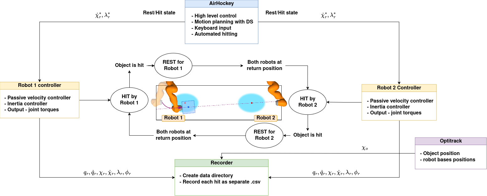

# AirHockey 

This repository contains the complete code for the data collection framework dubbed "Air Hockey". This framework consists of two KUKA IIWA robots hitting an object back and forth between each other's workspace. The hit object slides on a surface, leaving the hitting robot's workspace to end up in the receiving robot's workspace. The roles are then reversed and the object is hit back in the opposite direction. This setup allows for fast data collection on hitting objects, sliding and impact.

## Setup 

See [setup file](src/air_hockey/setup.md) for instructions on setting up the framework.

## Usage

See [usage file](src/air_hockey/usage.md) for instructions on setting up the framework.

## Authors/Maintainers 

Maxime Gautier : maxime.gautier@epfl.ch

## Previous work 
- H. Khurana and A. Billard, “Motion planning and inertia-based control for impact aware manipulation,” IEEE Transactions on Robotics, pp.1–16, 2023. [Paper Link](https://ieeexplore.ieee.org/stamp/stamp.jsp?arnumber=10297989)
- H. Khurana, M. Bombile, and A. Billard, “Learning to hit: A statistical dynamical system based approach,” in 2021 IEEE/RSJ International Conference on Intelligent Robots and Systems (IROS), 2021, pp. 9415–421. [Paper Link](https://ieeexplore.ieee.org/stamp/stamp.jsp?arnumber=9635976)
