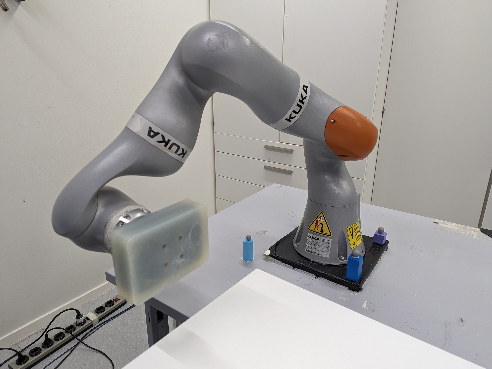
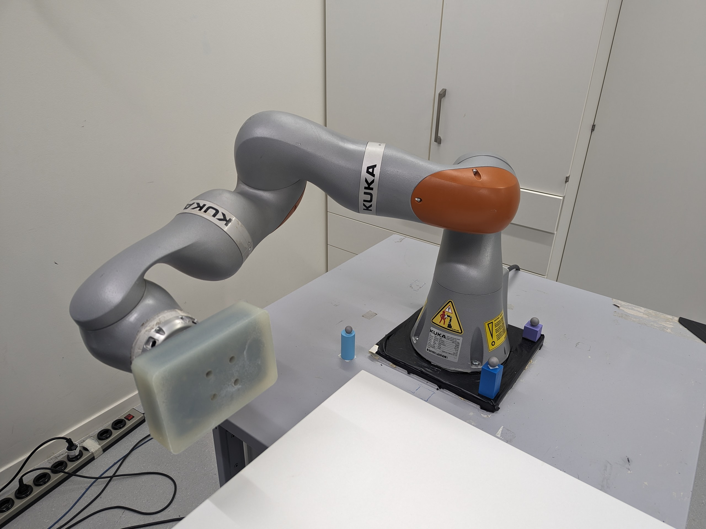

# Air_hockey - Usage

The Air_hockey package consists of two nodes: one for high level control of both robots and one to record the data of each hit, respectively called AirHockey and Recorder.
The provided launch files starts both nodes automatically.

## Recorder

The recorder can either record hits automatically or with the keyboard using:
'Z' to start recording IIWA7
'M' to start recording IIWA14
'G' to stop recording
Note: You can only record one robot at a time 

The recorded data for each robot is :
RobotName, RosTime, JointPosition, JointVelocity, JointEffort, TorqueCmd, EEF_Position, EEF_Orientation, EEF_Velocity, EEF_DesiredVelocity, Inertia, DirGrad, HittingFlux

The recorded data for the object is :
RosTime, PositionForIiwa7, OrientationForIiwa7, PositionForIiwa14, OrientationForIiwa14, PositionWorldFrame, OrientationWorldFrame, TimeWriting

## AirHockey - Simulation

Run the docker container, then in one terminal, launch the gazebo simulation:
``` bash
cd air_hockey
bash docker/start-docker.sh
roslaunch air_hockey air_hockey_sim.launch
```

## AirHockey - Real-life framework

### ROS Communication setup 

We use 2 computers, one connected to each robot. Both need the air_hockey docker image to run this framework.

**IMPORTANT** : Modify the ROS_IP and ROS_MASTER_URI parameters in the build-image.sh script according to the computers IP adresses. Computer 1 is the master.

Computer 1 --> connected to iiwa7 (= iiwa1 = iiwa left)
* ROS_MASTER_URI: 128.178.145.165 
* ROS_IP: 128.178.145.165 
Computer 2 --> connected to iiwa14 (= iiwa2 = iiwa right)
* ROS_MASTER_URI: 128.178.145.165 
* ROS_IP: 128.178.96.208 

### Terminal setup 

To facilitate starting commands, we connect via ssh from Computer 1 to Computer 2 :
```bash
ssh elise@128.178.96.208
```

You should have 4 terminals, 3 connected to the docker container on Computer 1 and one on the docker container on Computer 2. From now on, Computer 2 will refer to that last terminal (connected via ssh).

Make sure the docker image is build with the correct ROS_IP and ROS_MASTER_URI arguments.

Then run the docker container on each computers using :
``` bash 
bash docker/start-docker.sh 
```

Then connect to the container on Computer 1 with the two remaining terminals :
``` bash 
bash docker/start-docker.sh -m connect
```

### ROS launch commands

Launch the following commands in this order

Computer 1 - Terminal 1 :
```bash
roslaunch air_hockey optitrack_with_transform_to_base.launch
```
Computer 2 - Terminal 2 :
```bash
roslaunch iiwa_toolkit passive_track_real.launch robot_name:=iiwa2 model:=14
```
Computer 1 - Terminal 3 :
```bash
roslaunch iiwa_toolkit passive_track_real.launch robot_name:=iiwa1 model:=7
```
Computer 1 - Terminal 4 :
```bash
roslaunch air_hockey air_hockey_real.launch
```

Sequence for iiwa trackpad :
iiwa7 : FRIOverlayGripper -> Torque, 0, 0
iiwa14 : FRIOverlayGripper -> Torque, 0, 0

### Remarks and troubleshooting

Both computers must have the IP adress 190.170.10.1 for the connection to the iiwa as FRIOverlay communicates only with this adress.
Can modify the IP adress of the robot in iiwa_driver/config/iiwa.yaml

For optitrack, make sure Motive is streaming in Y-up format, and that all object frames matches the robot frame (X in front, Y to the left and Z up)

Use 'sudo chmod 777 -R .' when having trouble saving files inside container 

Use 'git config core.fileMode false' to avoid pushing chmod changes to github

**Developper Note** : In the start-docker.sh script, volumes are mounted on the folders src/air\_hockey, src/iiwa\_toolkit, python, data. Everything else inside the container and not in these folders will not be mofified on the host machine!


### Configurations

We have tested two different robot configurations on the iiwa 7 for this framework. These configurations include a joint position and a EE Pose

In iiwa\_toolkit/config/passive\_track\_params\_dual\_real.yaml, the following parameters must be changed : target/iiwa1/null\_pos
In air\_hockey/config/hit\_properties\_air\_hockey.yaml, the following parameter must be changed : iiwa7/return_position

The orientation shoud be the same, the position can change slightly. The joint position is used as the null_space desired position.
The orientation quaternion has the format W-xyz.

#### Configuration 1 - Elbow up




null_pos : [-0.48, 1.04,  0.02, -1.35, -1.92, -1.81, -0.81]

#### Configuration 2 - Elbow sideways



null_pos : [-1.125, 1.530, 1.193, -1.399, -2.819, -1.306, -0.355]

## Authors/Maintainers 

Maxime Gautier : maxime.gautier@epfl.ch


